# SASHER — Adaptive Fashion Recommendation System

> **Secure Adaptive Session-Aware Hybrid E-Commerce Recommendation Architecture**  
> Uniting on-device computer vision eye-tracking, transformer session intent prediction, and explainable AI personal styling.

[](https://vimeo.com/1230609125?share=copy&fl=sv&fe=ci)

> ▶️ **[Watch the Complete SASHER Architectural Walkthrough Video on Vimeo](https://vimeo.com/1230609125?share=copy&fl=sv&fe=ci)**


---

## 🌟 Overview

**SASHER** (*Secure Adaptive Session-Aware Hybrid E-Commerce Recommendation System*) is an ultra-luxury adaptive e-commerce platform designed to eliminate cold-start friction and cognitive shopping fatigue. 

By analyzing sub-conscious visual dwell time through privacy-preserving on-device eye tracking alongside transformer-based clickstream session graphs, SASHER dynamically calibrates an individual's latent aesthetic affinities (silhouette, textile drape, color harmony, and price sensitivity) in real time—with zero personally identifiable visual telemetry ever leaving the user's browser.

---

## 🏗️ System Architecture & Dataflow

The architecture diagram below illustrates the complete component topology, unidirectional state streams, and inter-service interactions:

```mermaid
flowchart TD
    Shopper((Shopper)) -->|uses| AppShell["App Shell<br/>[App.tsx]"]

    subgraph Application ["Application Layer"]
        AppShell -->|reads state| CommerceState["Commerce State<br/>[SasherContext.tsx]"]
    end

    %% Research Analytics Module
    subgraph ResearchAnalytics ["Research Analytics"]
        EvalAnalytics["Evaluation Analytics"]
        AIInsights["AI Insights<br/>[AIInsightsView.tsx]"]
        ResearchDash["Research Dashboard"]
        ProdResearch["Product Research"]
        PlatformAnalytics["Platform Analytics"]
        ResearchDash -->|includes| ProdResearch
    end

    %% Identity Services Module
    subgraph IdentityServices ["Identity Services"]
        OrderService["Order Service<br/>[orderService.ts]"]
        AuthContext["Auth Context<br/>[AuthContext.tsx]"]
        FirestoreStorage["Firestore Storage"]
        Firestore[(Firestore DB)]
        AuthContext -->|authenticates with| Firestore
        FirestoreStorage -->|reads and writes| Firestore
    end

    %% Gaze Adaptation Module
    subgraph GazeAdaptation ["Gaze Adaptation"]
        SessionIntent["Session Intent"]
        GazeTracker["Gaze Tracker<br/>[eyeTracker.ts]"]
        GazeEngine["Gaze Engine"]
        GazeStudio["Gaze Studio"]
        LiveAdaptation["Live Adaptation"]
        FashionAssistant["Fashion Assistant"]
        AssistantService["Assistant Service"]
        GeminiAPI["Gemini API<br/>[@google/genai]"]
        
        GazeTracker -->|uses| GazeEngine
        FashionAssistant -->|requests answers| AssistantService
        AssistantService -->|calls| GeminiAPI
    end

    %% Fashion Commerce Module
    subgraph FashionCommerce ["Fashion Commerce"]
        Navigation["Navigation<br/>[Navbar.tsx]"]
        ProductCatalog["Product Catalog<br/>[ProductGrid.tsx]"]
        ProductData["Product Data<br/>[products.ts]"]
        CartDrawer["Cart Drawer<br/>[CartDrawer.tsx]"]
        Checkout["Checkout<br/>[CheckoutModal.tsx]"]
        OrderDetail["Product Detail"]
        CustSupport["Customer Support"]
        OrderHist["Order History<br/>[OrderHistory.tsx]"]
        OrderTrack["Order Tracking"]
        Returns["Returns"]

        ProductCatalog --> OrderDetail
        OrderDetail --> OrderTrack
        CustSupport --> Returns
    end

    %% Routing and Interactions from App & Commerce State
    CommerceState -->|routes to| EvalAnalytics
    CommerceState -->|routes to| AIInsights
    CommerceState -->|routes to| ResearchDash
    CommerceState -->|routes to| PlatformAnalytics

    CommerceState -->|renders| OrderService
    CommerceState -->|uses| AuthContext
    CommerceState -->|saves user data| FirestoreStorage

    CommerceState -->|starts tracking| GazeTracker
    CommerceState -->|initializes from| SessionIntent
    CommerceState -->|routes to| GazeStudio
    CommerceState -->|routes to| LiveAdaptation
    CommerceState -->|renders| FashionAssistant

    CommerceState -->|renders| Navigation
    CommerceState -->|renders| ProductCatalog
    CommerceState -->|renders| ProductData
    CommerceState -->|renders| CartDrawer
    CommerceState -->|renders| Checkout
    CommerceState -->|opens| OrderDetail
    CommerceState -->|opens| CustSupport
    CommerceState -->|opens| OrderHist
    CommerceState -->|opens| OrderTrack
    CommerceState -->|opens| Returns
```



---

## 🧩 Architectural Breakdown

### 1. Application Layer
* **`App Shell [App.tsx]`**: The foundational single-page view router, handling theme management, overlay management, modal orchestration, and responsive viewport adaptations.
* **`Commerce State [SasherContext.tsx]`**: High-performance central reactive state bus orchestrating active gaze calibration, clickstream weights, product affinities, cart mutation, and order caching.

### 2. Gaze Adaptation & Vision Engine
* **`Gaze Tracker [eyeTracker.ts]`**: Client-side computer vision engine that calculates fixation centroids, saccades, and dwell periods across screen regions of interest (ROIs).
* **`Gaze Engine`**: Lightweight web worker computing calibrated gaze dispersion matrices with 9-point spatial calibration.
* **`Gaze Studio`**: Visual diagnostic laboratory for shoppers to inspect calibration precision, gaze heatmaps, and spatial gaze coordinates.
* **`Live Adaptation`**: Algorithmic re-ranking engine adjusting catalog item scores based on visual dwell vectors:
  $$\text{Score}(p_i) = \alpha \cdot \text{VisualDwell}(p_i) + \beta \cdot \text{SessionSequence}(p_i) + \gamma \cdot \text{AestheticFit}(p_i)$$
* **`Fashion Assistant & Assistant Service`**: Virtual consultant **Julian Laurent** with emotional state switching (`welcoming`, `thinking`, `complimenting`, `analyzing`), Web Speech vocalization, and grounding calls to the **Google Gemini API (`@google/genai`)**.

### 3. Identity Services & Persistence
* **`Auth Context [AuthContext.tsx]`**: Hybrid authentication supporting direct Google Firebase OAuth, 1-Click Atelier Patron access, and local session restoration.
* **`Order Service [orderService.ts]`**: Generates PDF receipts, dispatches tracking milestones, and synchronizes transactions.
* **`Cloud Firestore`**: Scalable NoSQL persistence maintaining encrypted user profiles, calibrated attention weights, and purchase histories.

### 4. Fashion Commerce
* **`Product Catalog [ProductGrid.tsx]`**: Infinite luxury grid with live attention indicators, material detail flags, and instant recommendation badges.
* **`Product Data [products.ts]`**: Structured product catalogue encompassing garments, accessories, timepieces, footwear, and curated capsules.
* **`Cart Drawer [CartDrawer.tsx]`**: Sliding luxury cart panel with live subtotal computations, free shipping calculators, and coupon validation.
* **`Checkout [CheckoutModal.tsx]`**: Frictionless multi-step payment gateway with credit card, UPI, Apple Pay, and COD support.
* **`Order History [OrderHistory.tsx] & Tracking`**: Detailed timeline tracking, tracking numbers, invoice downloads (`jsPDF`), and return initiation workflows.

### 5. Research Analytics
* **`AI Insights [AIInsightsView.tsx]`**: Visual breakdown of how latent eye gaze and session patterns influence ranking decisions.
* **`Research Dashboard`**: Quantitative evaluation tool presenting offline metrics, Top-K precision/recall charts, and NDCG comparisons.
* **`Platform Analytics`**: Macro metrics on user retention, average gaze dwell per product category, and checkout conversion rates.

---

## 🛠️ Technology Stack

| Layer | Technologies |
| :--- | :--- |
| **Frontend Framework** | React 19, TypeScript 5, Vite 8 |
| **Styling & Design** | Tailwind CSS v4 (Pure CSS `@import "tailwindcss";`), Editorial Typography |
| **AI & LLM Services** | `@google/genai` (Gemini Flash & Pro models for personalized styling) |
| **Vision & Speech** | Web Speech Synthesis API, Web Audio API, WebGaze spatial gaze tracking |
| **Persistence & Auth** | Firebase 12 (Cloud Firestore, Firebase Authentication) |
| **Visual Analytics** | Chart.js 4, React-ChartJS-2 |
| **Document Generation** | jsPDF, html2canvas (Luxury PDF order invoices) |
| **Icons & UI Micro-interactions** | Lucide React, CSS keyframe micro-animations |
| **Deployment** | Vercel (Configured with `vercel.json` SPA rewrites), Node.js Express server |

---

## 🚀 Getting Started

### Prerequisites
- **Node.js**: v18.0.0 or higher
- **npm** or **yarn** / **pnpm**

### Installation

1. **Clone the repository**:
   ```bash
   git clone https://github.com/your-username/sasher-adaptive-fashion.git
   cd sasher-adaptive-fashion
   ```

2. **Install project dependencies**:
   ```bash
   npm install
   ```

3. **Configure Environment Variables**:
   Copy `.env.example` to `.env`:
   ```bash
   cp .env.example .env
   ```
   Add your Gemini API and Firebase keys:
   ```env
   VITE_FIREBASE_API_KEY=your_firebase_api_key
   VITE_FIREBASE_AUTH_DOMAIN=your_project.firebaseapp.com
   VITE_FIREBASE_PROJECT_ID=your_project_id
   VITE_FIREBASE_STORAGE_BUCKET=your_project.firebasestorage.app
   VITE_FIREBASE_MESSAGING_SENDER_ID=your_messaging_sender_id
   VITE_FIREBASE_APP_ID=your_app_id
   GEMINI_API_KEY=your_gemini_api_key
   ```

4. **Launch Development Server**:
   ```bash
   npm run dev
   ```
   Open [http://localhost:3000](http://localhost:3000) in your browser.

---

## 🧪 Build & Quality Verification

```bash
# Type check without emitting files
npm run lint

# Compile optimized production bundle
npm run build

# Preview production build locally
npm run preview
```

### Production Chunk Splitting
The production Vite build is split into modular chunks:
- `vendor-react` (React 19 & React DOM runtime)
- `vendor-firebase` (Firebase App, Auth, & Firestore)
- `vendor-charts` (Chart.js & React-Chartjs-2)
- `vendor-icons` (Lucide React)
- `vendor-pdf` (jsPDF & html2canvas)

---

## 🌐 Deploying to Vercel

The application includes a pre-configured `vercel.json`:

```json
{
  "buildCommand": "npm run build",
  "outputDirectory": "dist",
  "framework": "vite",
  "rewrites": [
    {
      "source": "/(.*)",
      "destination": "/index.html"
    }
  ]
}
```

1. Import this repository in the [Vercel Dashboard](https://vercel.com).
2. Framework Preset will be automatically detected as **Vite**.
3. Add your environment variables in **Project Settings** → **Environment Variables**.
4. Click **Deploy**.

---

## 🔒 Privacy & On-Device Security

- **Zero Video Telemetry**: Camera frames used for gaze calibration are computed in real-time in volatile client memory and immediately discarded.
- **Client-Side Spatial Calibration**: Coordinates are normalized to DOM bounding rects without transmitting camera feeds.
- **Secure Fallbacks**: Offline and sandbox modes operate seamlessly with localStorage caching when cloud network access is restricted.

---

## 🎨 UI/UX Design System (Redesigned Dashboard)

SASHER features a premium dark fashion-commerce dashboard design inspired by high-end luxury stores and modern AI interfaces:
- **Dark Editorial Palette**: `#0D0D0D` main background, `#151515`/`#181818` card surfaces, and warm champagne/beige (`#d4a373`) accents.
- **Fixed Left Sidebar (`Sidebar.tsx`)**: Compact 240px navigation rail with icon links (`Home`, `User`, `Browse`, `Favorites`, `Analytics`, `Shopping`, `History`, `Concepts`) and saved item search.
- **Professional Top Navigation (`TopNavigation.tsx`)**: Sticky header featuring a large rounded search bar, "Open Closet" champagne button, shopping bag count badge, notification indicator, and user profile avatar.
- **5-Column Product Grid (`ProductGrid.tsx`)**: High-density editorial product presentation featuring compact filter pills (`[ User ▾ ] [ All Sizes ▾ ] [ Categories ▾ ] [ Colors ▾ ] [ Occasions ▾ ]`), sorting controls, and visual interest lock reticles.
- **Curated Recommendations Section (`RecommendationsSection.tsx`)**: Dedicated row showcasing items tailored to real-time session intent.

---

## 📄 License

Distributed under the MIT License. See `LICENSE` for more information.

---

*Crafted with precision for the future of adaptive luxury commerce.*
